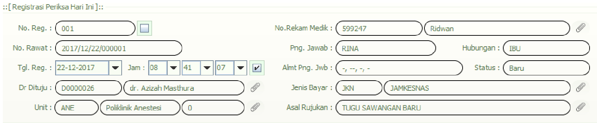

# 1-1 Pendaftaran Pasien Rawat Jalan

## 1. Menambahkan Data Pasien  

### Langkah-langkah:  

1. Masuk ke menu **Registrasi** dengan menekan tombol **Registrasi**.  
     

2. Klik simbol **klip kertas 📎** di sebelah kolom **No Rekam Medik**.  
     

3. Pada tampilan **[Data Pasien]**, klik tombol **Baru** untuk menambahkan pasien baru.  
     

4. Isi formulir biodata pasien dengan data lengkap.  
     

5. Setelah semua biodata terisi, klik tombol **Simpan** untuk menyimpan data pasien.  
     

---

## 2. Memilih Dokter untuk Pasien  

### Langkah-langkah:  

1. Pada bagian **Input Data**, pilih data pasien dengan melakukan **klik dua kali** pada nama pasien.  
   - Indikator: teks data pasien akan berubah menjadi warna merah.  
   - Setelah itu, tekan tombol **Spasi** pada keyboard.  

     

2. Tampilan akan berpindah ke halaman **[Registrasi Periksa Hari Ini]**.  
     

3. Pilih **Dokter**, **Unit**, **Asal Rujukan**, lalu klik tombol **Simpan**.  
     

4. Data pasien berhasil disimpan.  
     

