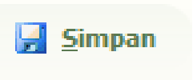

# 1-2 Pendaftaran Pasien Rawat Inap  

### Langkah-langkah:  

1. **Pastikan pasien sudah terdaftar di Rawat Jalan.**  
   Sebelum mendaftarkan pasien sebagai pasien rawat inap, pasien harus terlebih dahulu terdaftar di Rawat Jalan. Panduan pendaftaran pasien Rawat Jalan dapat dilihat [di sini](./1-1-pendaftaran-pasien-rawat-jalan.md).  

2. **Buka menu "Kasir Ralan".**  
   Pilih menu **[Kasir Ralan]**, yang merupakan singkatan dari Kasir Rawat Jalan.  
     

3. **Cari data pasien.**  
   Masukkan **No Rekam Medik** atau **Nama Pasien** pada kolom **Key Word** untuk mencari data pasien.  
     

4. **Pilih pasien.**  
   Setelah data pasien muncul: 
   - Klik dua kali pada data pasien.  
   - Pastikan teks berubah menjadi warna merah sebagai indikator pasien telah dipilih.  

5. **Buka menu pop-up.**  
   Klik kanan pada data pasien untuk membuka menu pop-up.  

6. **Pilih menu "Kamar Inap".**  
   - Setelah memilih **Kamar Inap**, form **[Input Kamar Inap Pasien]** akan muncul.  
     

7. **Pilih kamar pasien.**  
   - Klik simbol **klip 📎** pada kolom kamar di sebelah kiri **Stts. Kamar**.  
   - Pilih kamar yang sesuai untuk pasien.  
     

8. **Simpan data.**  
   - Setelah memilih kamar, klik tombol **Simpan** untuk menyimpan data kamar inap pasien.  
     

