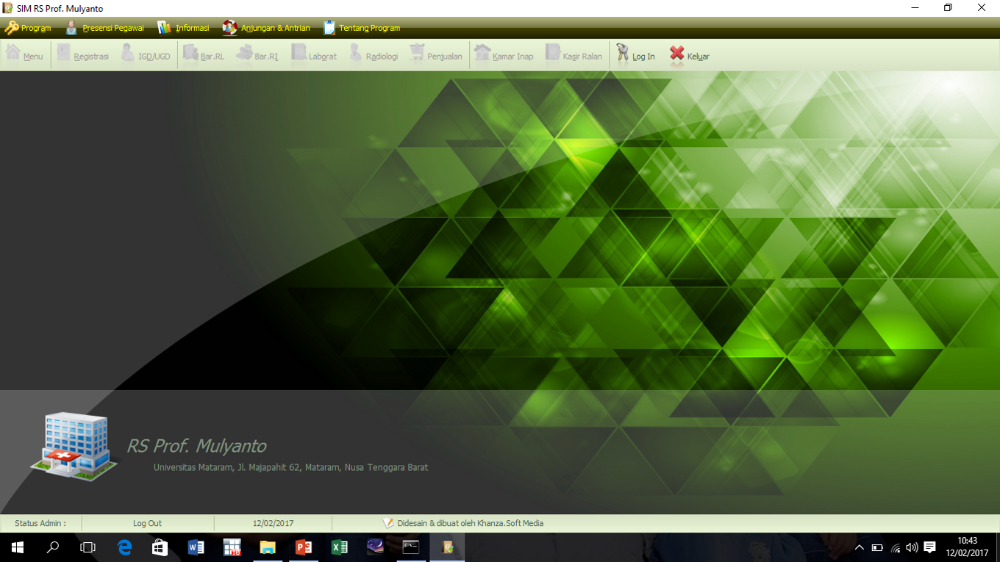
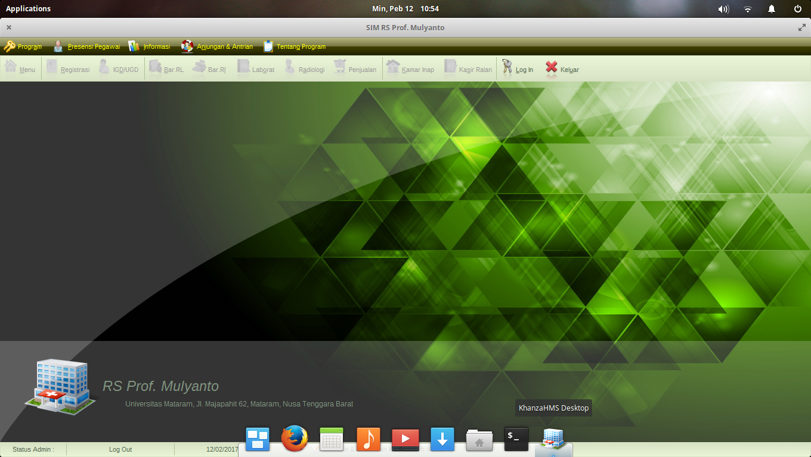
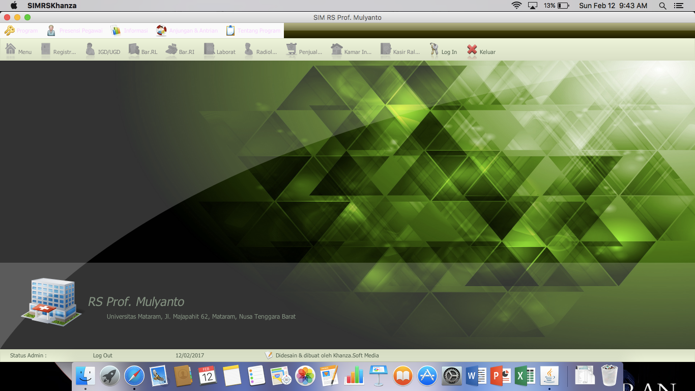

# SIMRS-Khanza Wiki

Software ini adalah perangkat lunak Manajemen Rumah Sakit/Klinik/Puskesmas yang **gratis**, **sumber terbuka**, dan dapat digunakan oleh siapa saja tanpa dikenakan biaya apa pun. Namun, **dilarang keras memperjualbelikan atau mengambil keuntungan dalam bentuk apa pun** dari software ini tanpa izin dari pembuatnya, **Khanza.Soft Media**.

Software ini menggunakan lisensi **[Aladdin Free Public License](https://en.wikipedia.org/wiki/Aladdin_Free_Public_License)**.

Untuk informasi lebih lanjut dan panduan penggunaan (**official**), Anda dapat mengunjungi halaman berikut:  
👉 **[Official Wiki SIMRS Khanza](https://github.com/mas-elkhanza/SIMRS-Khanza/wiki)**

Hasil build/software siap pakai dapat diunduh melalui tautan berikut:  
👉 **[Download SIMRS Khanza](https://drive.google.com/drive/folders/0ByL--Jg6bdF7RG1NSlVTT2ZPODg)**

Jika Anda ingin berdonasi untuk mendukung pengembangan SIMRS Khanza, donasi dapat dilakukan melalui:  
**Bank Syariah Indonesia (BSI)**  
Nomor Rekening: **1015369872**  
Atas Nama: **Windiarto**

## Gambaran Umum

**SIMRS Khanza** adalah aplikasi Sistem Informasi Manajemen Rumah Sakit dengan model **client-server**.  

- **Aplikasi Client:**  
  Dibangun menggunakan bahasa **Java**, bersifat **cross-platform**, sehingga dapat dijalankan pada sistem operasi **Windows**, **Linux**, maupun **macOS**.  

- **Aplikasi Server:**  
  Berbasis **webapps** dengan bahasa **PHP**, didukung oleh database **MySQL** atau yang setara (**MariaDB**, **Percona**). Webserver yang direkomendasikan untuk aplikasi ini adalah **Apache**.  

---

## Contoh Tampilan Aplikasi  

### 1. Tampilan Client SIMRS Khanza di Windows 10  
Berikut adalah contoh tangkapan layar aplikasi client SIMRS Khanza yang dijalankan pada **Windows 10**:  

---

### 2. Tampilan Client SIMRS Khanza di Linux  
Berikut adalah contoh tangkapan layar aplikasi client SIMRS Khanza yang dijalankan pada **Linux**:  

---

### 3. Tampilan Client SIMRS Khanza di macOS  
Berikut adalah contoh tangkapan layar aplikasi client SIMRS Khanza yang dijalankan pada **macOS Sierra**:  

---

Teks ini telah dirapikan untuk meningkatkan keterbacaan dan profesionalitas. Pastikan tangkapan layar disertakan sesuai deskripsi masing-masing platform. 😊