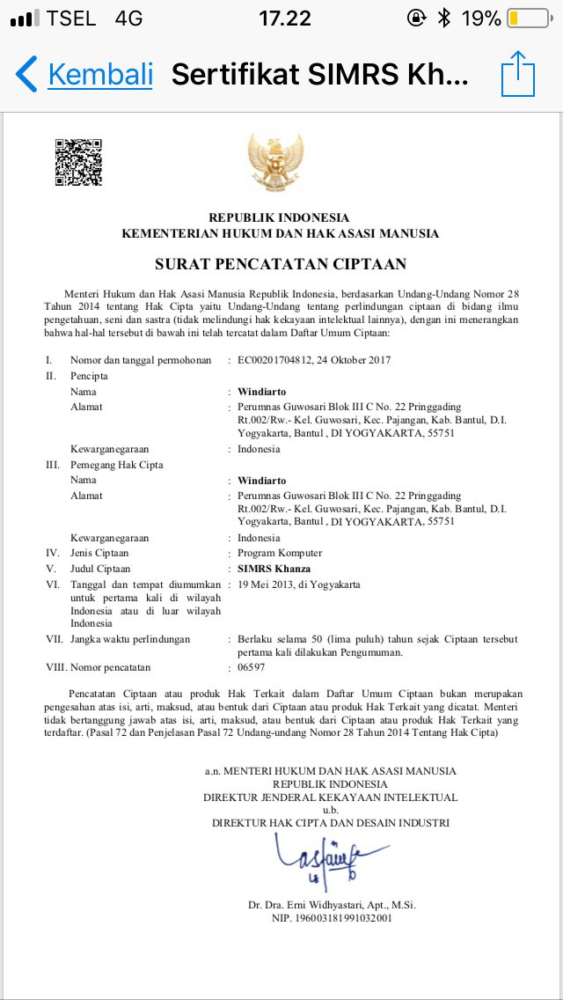
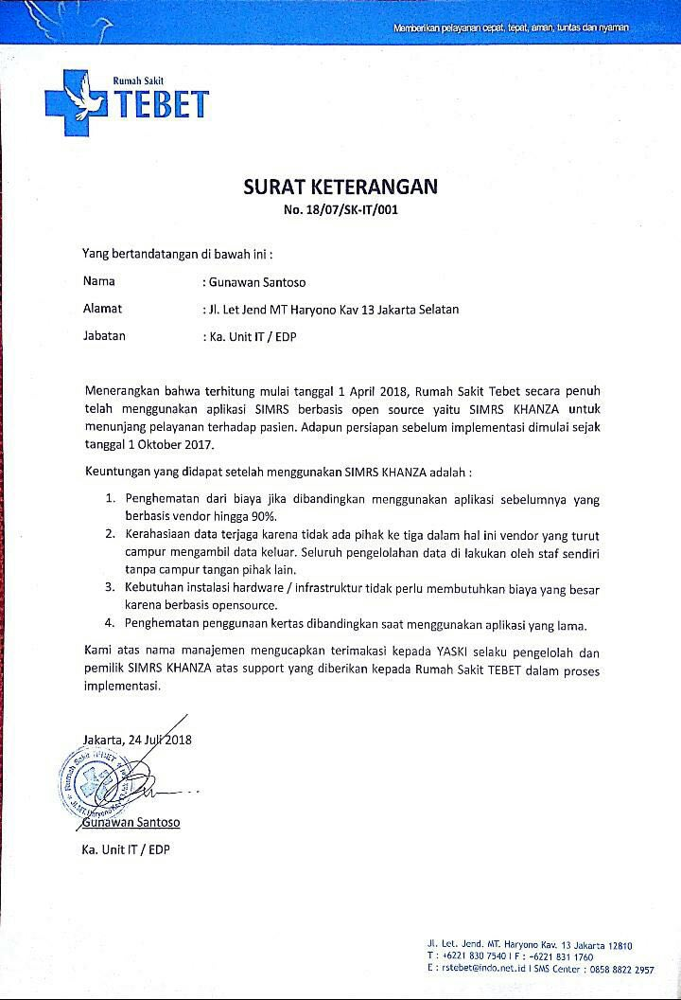
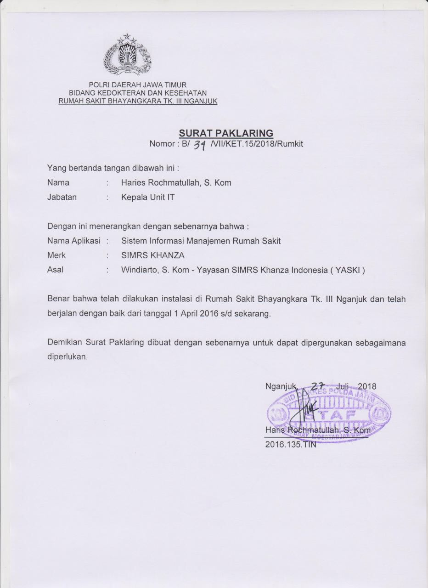
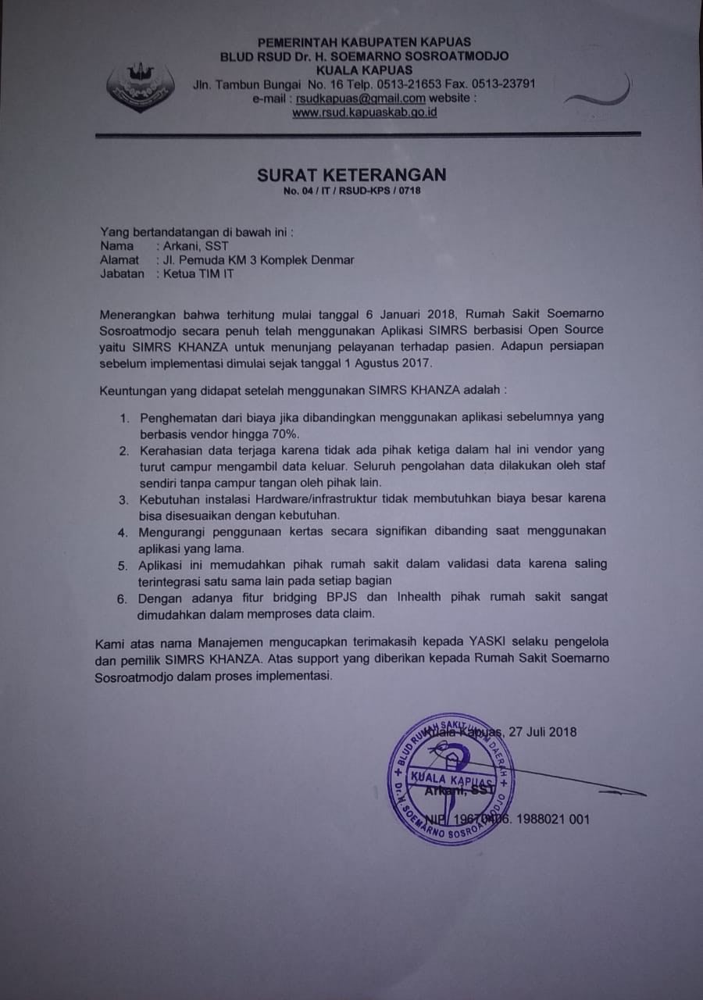
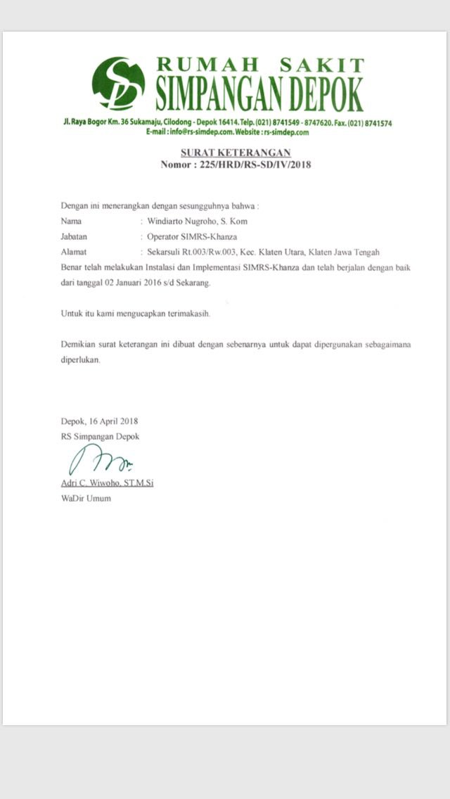
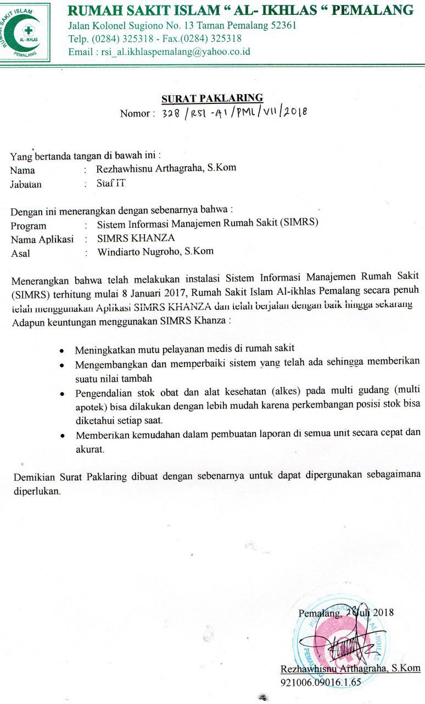
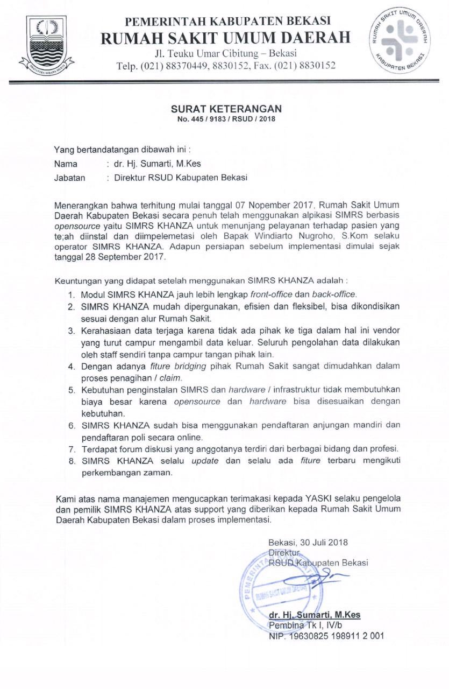
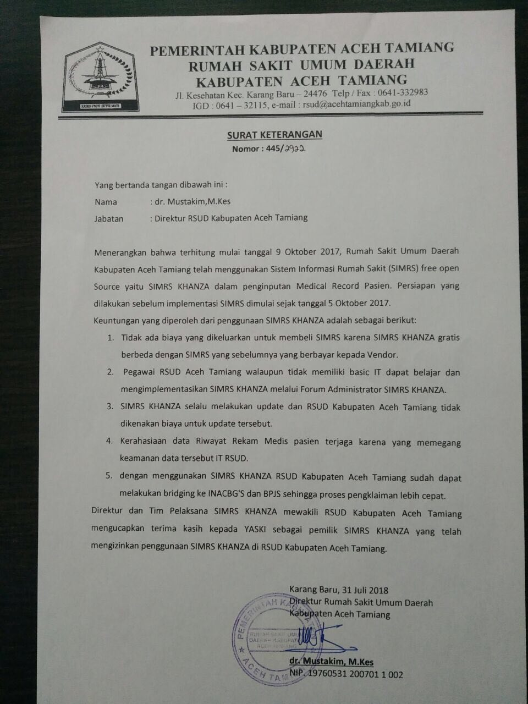

# Lisensi  

**Ketentuan Penggunaan**  
- **Dilarang keras** memperjualbelikan atau mengambil keuntungan dalam bentuk apa pun dari aplikasi ini.  
- Aplikasi ini **hanya boleh digunakan untuk kebutuhan rumah sakit, klinik, puskesmas, atau instansi kesehatan lainnya**.  

---

## Perlindungan Hukum  

Untuk memastikan aplikasi dan source code ini dimanfaatkan dengan benar, saya, sebagai pembuat aplikasi, telah **mencatatkan hak cipta di Direktorat Jenderal Hak Kekayaan Intelektual (HAKI)**.  

Bagi siapa pun yang menyalahgunakan aplikasi atau source code ini, akan dikenakan tindakan hukum sesuai peraturan yang berlaku.  

  

---

## Paklaring/Surat Keterangan Penggunaan  

Berikut adalah contoh **paklaring/surat keterangan penggunaan SIMRS Khanza** dari beberapa rumah sakit pengguna:  

  
  
  
  
  
  
  
